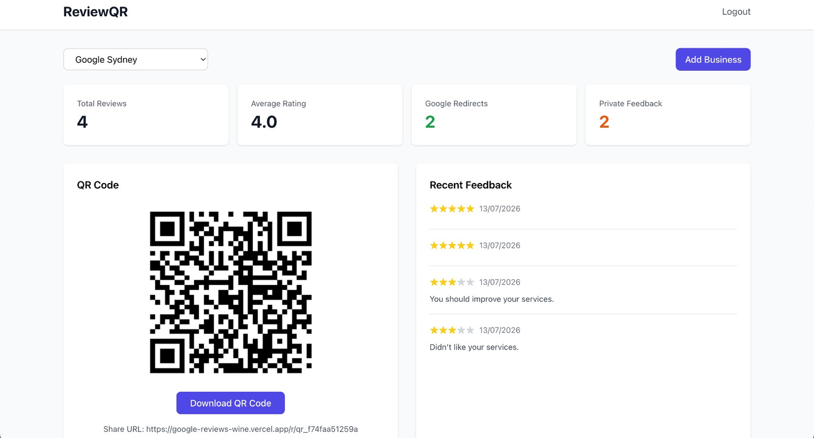
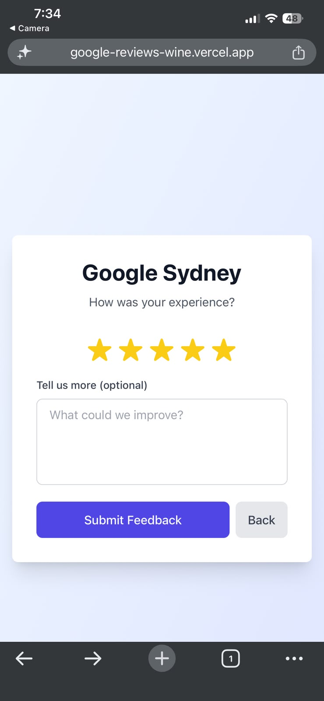

# ReviewQR

**QR-based review management for small businesses — routes happy customers to Google Reviews, catches unhappy ones privately.**

[](https://google-reviews-wine.vercel.app)

[View Live Site](https://google-reviews-wine.vercel.app)

<!--
Business dashboard: desktop, 1440x900 (16:10), PNG.
Rating page: mobile, iPhone 12 Pro Max (1284x2778), PNG — this page is scanned via phone, so a
mobile shot tells the real story better than a desktop one.
-->

| | |
|---|---|
| **Business dashboard** (desktop) |  |
| **Customer rating page** (mobile) |  |

## Overview

ReviewQR helps small businesses collect more public Google reviews while catching negative feedback before it goes public. A customer scans a business's QR code, rates their experience 1–5 stars, and is routed accordingly: 4–5 stars go to Google Reviews, 1–3 stars land on a private feedback form only the business owner sees.

## Features

- JWT authentication (httpOnly cookies) for business owners
- Business profile management with a unique QR code per business
- Customer rating flow (1–5 stars)
- Smart routing: 4–5★ → Google Reviews, 1–3★ → private feedback form
- Analytics dashboard with rating and feedback stats
- Mobile-responsive throughout

## Tech stack

- **Framework:** Next.js 14 (App Router), TypeScript
- **Database:** Supabase (PostgreSQL)
- **Auth:** JWT with httpOnly cookies
- **QR codes:** `qrcode` npm package
- **Styling:** Tailwind CSS

## Project structure

```
googleReviews/
├── app/
│   ├── api/
│   │   ├── auth/        # Login/signup endpoints
│   │   ├── business/    # Business management
│   │   ├── feedback/    # Feedback storage
│   │   └── qr/           # QR code generation
│   ├── dashboard/        # Business owner dashboard
│   ├── r/[id]/            # Customer rating page
│   └── page.tsx           # Login/signup page
├── lib/
│   ├── auth.ts            # Authentication utilities
│   └── supabase.ts        # Database client
└── schema.sql              # Database schema
```

## Database schema

- **users** — `id`, `email`, `password_hash`, `created_at`
- **businesses** — `id`, `user_id`, `business_name`, `google_review_url`, `qr_code_id`, `created_at`
- **feedback** — `id`, `business_id`, `rating`, `feedback_text`, `created_at`

## Getting started

```bash
git clone https://github.com/ShoaibRana888/googleReviews.git && cd googleReviews
npm install
cp .env.example .env
```

1. Create a free [Supabase](https://supabase.com) project, then run `schema.sql` in the Supabase SQL editor to create the tables.
2. Fill in `.env`:

| Variable | Purpose |
|---|---|
| `NEXT_PUBLIC_SUPABASE_URL` | Your Supabase project URL |
| `NEXT_PUBLIC_SUPABASE_ANON_KEY` | Supabase anon/public key |
| `JWT_SECRET` | Random string, 32+ chars (`openssl rand -base64 32`) |
| `NEXT_PUBLIC_APP_URL` | `http://localhost:3000` locally |

```bash
npm run dev   # → http://localhost:3000
```

A business owner's Google Review URL comes from their [Google Business Profile](https://business.google.com) → "Get more reviews."

## Deployment

Deployed on [Vercel](https://vercel.com). Set the same environment variables in the Vercel dashboard, with `NEXT_PUBLIC_APP_URL` pointing at your production domain.

## Contact

**Shoaib Rana** — [shoaib.rana888@gmail.com](mailto:shoaib.rana888@gmail.com) · [Portfolio](https://portfolio-pied-two-34.vercel.app/) · [GitHub](https://github.com/ShoaibRana888)
